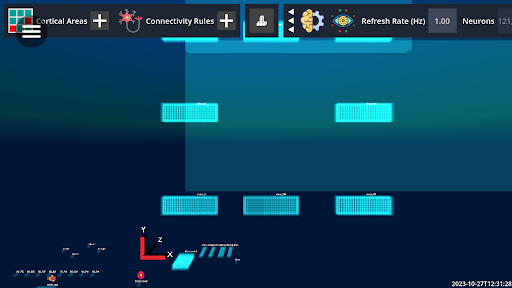
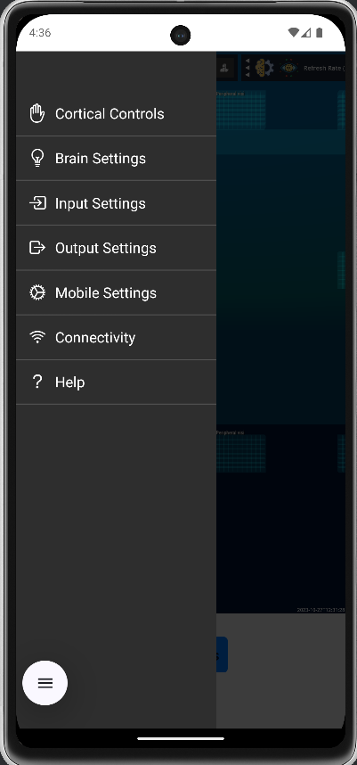
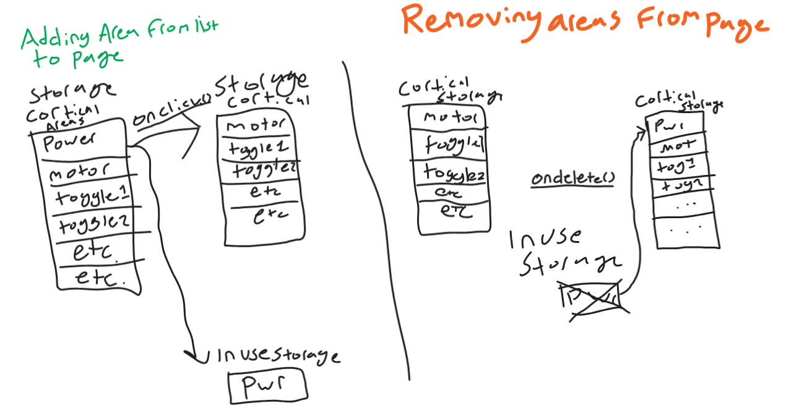
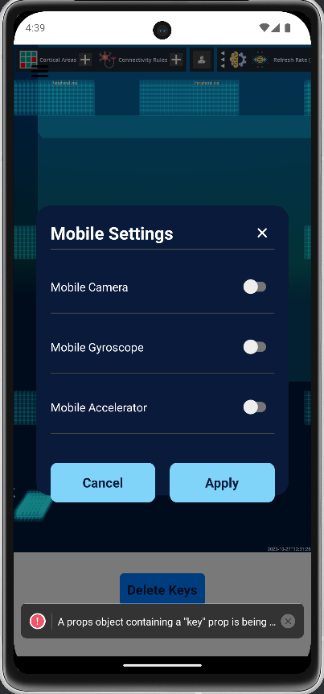
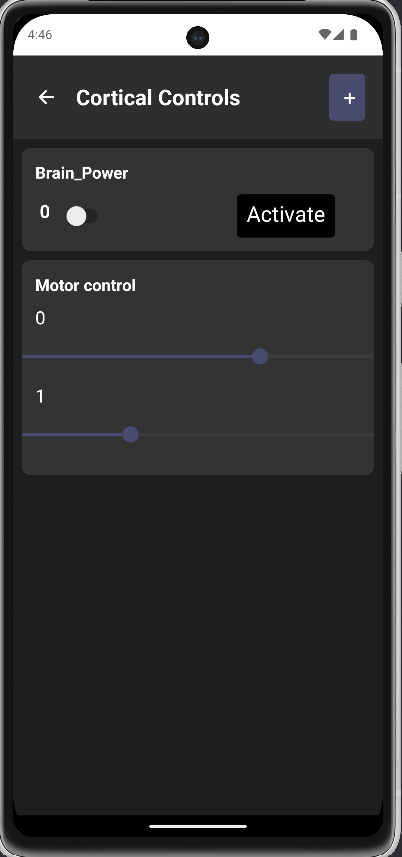

# Feagi Mobile App
**Members:** *[Ben Gradeck](https://www.linkedin.com/in/ben-gradeck-2240031b2/), Huma Mamnoon, Ed Xu, Cole Metrick*
Apr 17, 2025

## Overview
Our capstone group spent the semester developing an app that allows users to access Neurorobotics Studio on the go. Users can view an active FEAGI session in the Brain Visualizer on their mobile device, trigger and update cortical controls, and send camera and gyroscope data to FEAGI. The app works on both iPhone and Android devices and accepts both portrait and landscape viewing. Through mobile settings, users are afforded different interactions with FEAGI that would not be possible on a computer. Users can stimulate cortical areas on their phone, which could allow for new robotics testing methods. Gyroscope, accelerometer, and camera data can be streamed to cortical areas, the former two of which are impossible to send from standard computers.  

## Development and Features
We started developing by playing around with the features of React Native such as states, props, forms, etc. After we got a handle on the basics we began designing the app according to the specifications provided for us by Neuraville. We developed an initial loading screen that would take the user to any active FEAGI session if logged in; alternatively it would take them to a page with an API key input and form a connection to the server. From there we used WebView to display the Brain Visualizer on the screen. While developing, we employed React's AsyncStorage functionality to save user data such as their API Key and then later on, cortical control areas to display. 
To display all of the app's functionality, we developed a simple hamburger menu that would allow users to access the apps additional functionality. When clicked the Hamburger menu would switch positions on the apps screen as it was toggled on or off which gave it an effect of sliding open when clicked. The menu items would either open a modal or take the user to seperate pages. 

Reading and sending data to and from the API was a difficult task throughout the project. Having had little experience with API work in the past, our team had to figure things out on the fly. Parsing through the API and getting each required cortical area to show up in the controls was the first difficult task. After they were read in, they were displayed using React Native components. Data was stored in each of the components and was sent back to the API as the data changed. The method for sending sustained simulation back to the API was changed halfway through the project, but did not pose any large challenges for our group to overcome. To save user choices about which cortical areas to display, AsyncStorage was used allowing us to save user data on the phone. The process involved saving all possible areas to AsyncStorage. As users clicked to load their cortical areas on the page The item would be removed from user storage and displayed using React Native Components. If it got deleted it was saved back into user storage and ready to be loaded again. A problem that this system posed was since areas that were loaded were removed from user storage, if the user left the page and came back their cortical areas would not be loaded in. I fixed this issue by saving a copy of the cortical area that would be displayed on screen. As the page was loaded these saved cortical areas would be loaded to the screen. As the areas were removed they would be removed from on saved storage and added back into regular user storage. This concept is a little hard to explain so I am adding a rough diagram to explain the process. 
### Diagram

### Mobile page and Cortical Controls
 

The connectivity page was one of the last quality of life features. It allows users to change their API key if needed. This will allow users to switch FEAGI Genomes as needed without deleting all their keys. 

## Challenges
None of our group members had any experience with React Native development before starting the project. Learning to develop with React Native was one of the larger hurdles while developing. 

Early in development there were some problems with getting the Neuraville to display using WebView. I tried all combinations of links and tweaks but nothing seemed to work. Through further testing I realized that running Neuraville on a Google Pixel XL was not possible. It was only possible to run the service on newer phone models. 

Developing the cortical control page was a significant challenge. First the cortical controls had to be read in from the API. These controls had to be queried by their dimensions which specified their type, toggles or sliders, how many of the controls were to be displayed, and if the cortical area should be displayed at all. 

Sending API data to Neurorobotics Studio sometimes takes a few seconds/minutes to register through the API. I am not sure if that is a problem with our app or with the backend server but it has been a bit of a problem. 

## Future Work
For the future of this project our team would like to see the Godot view update and work correctly with the touch screen controls. Some work was done to diagnose potential problems with touchscreen compatibility on mobile and it was thought that a solution was found. Being able to pan around and interact with the Neurorobotics Studio view was a large goal for this project and we hope that it will be fixed on the web and become available in the app. 

###App Demo: 

