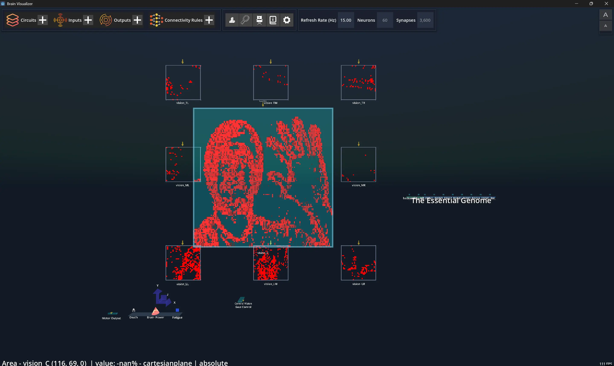

# Learning and Using Neurobotics Studio

Over the last couple of months, the community development team, consisting of Maximillian and Eric, has been learning FEAGI, its related tools, and the soon to be released Neurorobotics Studio. Along with learning how these systems work, we also used them to create demonstrations that showed what is possible with FEAGI in both robotics and simulation. 

## Background

Max: One of the most interesting parts of this experience was how different it was from what I had done before. I came into this with programming experience, especially in Python, and with a background in computer science and physics. That helped when it came to learning new tools, debugging issues, and understanding the overall logic behind how systems connect. Before this, I had never worked with robots, never worked with FEAGI or neurorobotics, and had no real experience with concepts like cortical areas or how they relate to control. I also had never made videos or done any real editing before. I definitely did not expect to be doing something that felt like building a brain for a robot, especially in a way that required little to no coding.

Eric: Working with Feagi was definitely an enriching experience. Despite spending so much time studying Computer Science, I never thought that I would be able to so intuitively create simulations with robotics. Once I figured out how to set up Feagi on my computer, it was only hours of work before being able to create semi-complicated circuits controlling robotic simulations. The circuits created could feasibly be used to control the physical machines we’re simulating, which is very exciting! On top of that, it was refreshing being introduced to a community of developers who care. At any stage in my learning process, there was a full discord of Devs ready to help me through any bumps I came across. My feedback on Neurorobotics Studio was also heard openly. It’s free and encouraged to join the Neuraville Discord, so please feel free to connect if you want to get the most out of Feagi! It, of course, also looks good on a resume to be working with these complicated robotic simulations, so my heartfelt thanks go out to Neuraville and the development team behind the brain-inspired Artificial Intelligence Framework Feagi. 

## Getting Started with FEAGI
Like most new technologies, getting started was not completely smooth. FEAGI itself took some effort to set up, and there were also challenges involving Brain Visualizer, updates, and platform-specific issues. In some cases, the process was more strenuous on Mac, and in other cases, the documentation reflected issues that users were likely to run into while setting things up. There were also some MuJoCo simulations that were not compatible at the time, which added another layer of trial and error.

That early difficulty ended up being useful because it showed us what new users are actually likely to run into. There is a big difference between reading instructions and trying to get a system running when parts of it do not work right away.

## Building Our First Brain

Once we got further into the platform, one of the most interesting parts was learning how to build and interact with a brain inside Neurorobotics Studio. Instead of treating the brain as something abstract, we were able to actually see activity and start understanding how different inputs could cause different responses.

A major part of the process was learning how to use visual input to spike cortical areas. For example, by using a hand on camera and lighting up parts of the visual field, we could activate peripheral vision areas and generate spikes in the brain. From there, those spikes could be tied to robot control. That was one of the moments where the system started to feel real, since we could actually see sensory input create activity and connect to action.

What made this especially interesting was how approachable it became once we were inside the studio. Beforehand, ideas like cortical activation, sensory processing, and robot control sounded like things that would require a huge amount of code and prior knowledge. In practice, Neurorobotics Studio made it possible to interact with these ideas in a much more visual and intuitive way that lowered the barrier to entry and made experimenting much easier than I expected.

## Working with MuJoCo Simulations

As we became more comfortable with controlling the brain, understanding cortical areas, and seeing how inputs could drive behavior, we started working more with MuJoCo simulations through Neurorobotics Studio. 

At that point, we were able to create videos that showed the power and utility of FEAGI and Brain Visualizer more directly. Rather than only describing what the platform could do, we could show it, which made it easier for new people to understand.

These videos also became part of a broader goal we had for community development. As we learned about the platform, we were also thinking about how to bring more attention to FEAGI itself. One of the goals was to help increase awareness and credibility for the GitHub repository. A stronger public presence, more engaging demos, and clearer examples all make it easier for new people to take the project seriously and feel interested in exploring it themselves.

This video, for example, shows the Brain Visualizer being used to control Spot the robot dog from Boston Dynamics!

## Sharing With the Community

Throughout the process, we were not only learning how to use the software. We were also thinking about how to share what we were learning in a way that would be useful and interesting to other people. That meant creating videos and clips that could serve two purposes at once. First, they could help show people how the software works. Second, they could act as eye-catching examples that draw attention to the technology.

## Reflections

Looking back, this experience taught me a lot more than just how to use FEAGI, Brain Visualizer, and Neurorobotics Studio. Through the process of making videos and trying to attract interest, I learned more about things like testing what content works, presenting ideas clearly, and thinking about how to create something that people want to stop and watch.

At the same time, the technical side was equally valuable. I came in with no background in robotics or neurorobotics, and by the end of this process, I was able to use the studio, understand the role of cortical areas, work with brain-based control ideas, and help create demonstrations that showed these systems in action. That shift from having no experience in the area to being able to build, test, and present with the tools was probably the most rewarding part of the whole experience. More than anything, this project showed how quickly a new area can become approachable when the tools are designed well and when learning is treated as an active process.
